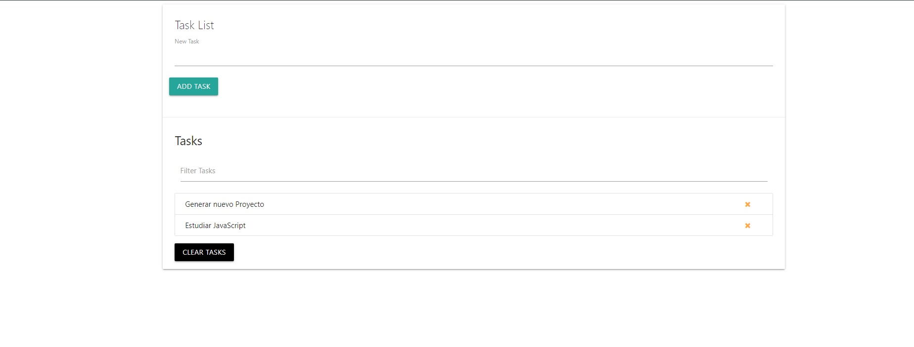

# Lista de Tareas.

## Objetivo
+ Creacion lista de tareas en JS
+ Añadir tareas.
+ Borrar tarea individualmente.
+ Borar todas las tareas.
+ Persistencia de los datos en LocalStorage.

### Visita el Proyecto.

[Visita el proyecto](https://miguelpl32.github.io/taskList/)

